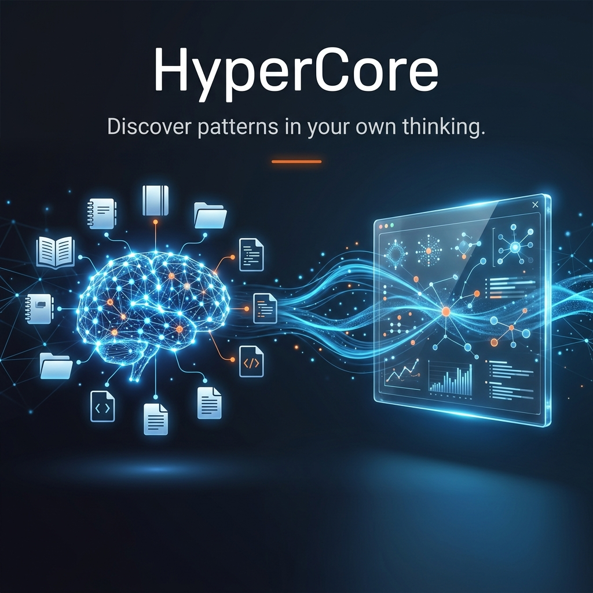

# Hypercore

<p align="center">
  
</p>

**A local AI that learns from your documents, remembers your decisions, and helps you discover patterns in your own thinking.**

CPU-first LLM inference runtime + personal intelligence system, written in Rust.

[Quickstart](#quickstart) • [Personal Intelligence](#personal-intelligence) • [Inference Engine](#inference-engine) • [Benchmarks](#benchmarks) • [Architecture](#architecture)

  

---

## What Makes This Different

Most local AI tools store **chunks and embeddings**. They can answer:
> "What does document X say?"

Hypercore builds a **personal memory graph**. It can answer:
> "What decisions have I made repeatedly?"  
> "What technologies do I consistently prefer?"  
> "What patterns appear across my projects?"

That's the difference between retrieval and intelligence.

---

## Quickstart

### From Source
```bash
# Prerequisites: Rust 1.80+, CMake, Clang
git clone https://github.com/SBALAVIGNESH123/hypercore-rs.git
cd hypercore-rs
cargo build --release
```

### Ingest Your Documents
```bash
# Ingest markdown, text, YAML — any natural language files
hypercore ingest --path ./my-notes
hypercore ingest --path ./meeting-notes
hypercore ingest --path ./journal
```

### Discover Patterns
```bash
# See your extracted memories
hypercore memory show

# See your work evolution
hypercore memory timeline

# "Why am I like this?" — deep self-analysis
hypercore memory --model ./model.gguf explain

# Weekly personal insight report
hypercore memory --model ./model.gguf insight

# Discover recurring themes
hypercore memory --model ./model.gguf patterns

# Recall why you made a specific decision
hypercore memory --model ./model.gguf recall "database"
```

### Run the API Server
```bash
hypercore serve --model ./model.gguf --port 8080

# OpenAI-compatible endpoint
curl http://localhost:8080/v1/chat/completions \
  -H "Content-Type: application/json" \
  -d '{"model":"hypercore","messages":[{"role":"user","content":"Hello"}]}'
```

---

## Personal Intelligence

### How It Works

```
Your Documents → Ingestion → Embeddings + Chunks → SQLite
                                                      ↓
                                              Memory Extraction
                                           (natural language only,
                                            source code skipped)
                                                      ↓
                                              Memory Graph
                                        (Decisions, Preferences,
                                         Projects, Relationships)
                                                      ↓
                                         LLM Synthesis (optional)
                                        Compressed memories fed to
                                        local model for insight
                                                      ↓
                                              Insight + Feedback
                                         "Was this surprising?" (1-4)
```

### Commands

| Command | What It Does |
|---|---|
| `memory show` | Display your extracted memory graph by category |
| `memory timeline` | Chronological view of your decisions and projects |
| `memory recall <topic>` | Find evidence and context for past decisions |
| `memory patterns` | Theme distribution, word frequency, source analysis |
| `memory explain` | "Why am I like this?" — synthesize your decision-making DNA |
| `memory insight` | Generate a weekly personal observation report |

### With LLM Synthesis

Add `--model <path.gguf>` to any memory command for AI-powered synthesis:

```bash
# Without model: shows raw data + statistics
hypercore memory patterns

# With model: compressed memories → LLM → synthesized insight
hypercore memory --model ./qwen-3b.gguf patterns
```

The system:
1. Retrieves all memories from SQLite
2. Clusters by category (Decision, Preference, Project, Relationship)
3. Compresses to ~200 tokens (3 examples per cluster)
4. Prints token budget instrumentation
5. Sends to local LLM for synthesis
6. Streams the response
7. Asks for feedback (1-4 rating, persisted)

### Feedback Loop

After every insight, Hypercore asks:
```
How valuable was this insight?
  1) Obvious
  2) Somewhat useful
  3) Surprising
  4) Changed how I think
```

Ratings are persisted to `insight_feedback` in SQLite. This is how you measure whether the system is generating real value.

---

## Inference Engine

### Capabilities

| Feature | Description |
|---|---|
| Continuous Batching | Round-robin chunked prefill, up to 4 concurrent sessions |
| Memory Pressure Rejection | Explicit `AdmissionRejected` under pressure — no silent OOMs |
| Request Timeouts | 300s deadline, auto-eviction of stuck sessions |
| Temperature Sampling | Greedy (T=0) or stochastic sampling |
| LoRA Support | Adapter path configurable (loading not yet implemented) |
| EOS Detection | Auto-stop on end-of-generation tokens |

### TitanMem

Adaptive KV-cache congestion controller with:
- Dual-signal EMA (utilization + pressure)
- Hysteresis mode transitions (Calm → Cautious → Critical)
- Dynamic threshold tuning
- Per-session byte tracking

**Status**: Real, tested, working. See [benchmark results](docs/titanmem_benchmarks.md).

### API Server

| Endpoint | Method | Description |
|---|---|---|
| `/health` | GET | Health check |
| `/metrics` | GET | Prometheus metrics |
| `/v1/models` | GET | List models |
| `/v1/chat/completions` | POST | Chat completions (streaming + non-streaming) |

OpenAI SDK compatible. Set `HYPERCORE_API_KEY` for authentication.

---

## Knowledge Store

- **SQLite** with hybrid FTS5 full-text search + cosine vector similarity
- **Content-hash deduplication** — re-ingesting the same file is a no-op
- **Tree-sitter parsing** for C/C++ files (function-level chunking)
- **Streaming ingestion** with batch embedding (64 chunks per batch)

---

## Evaluation

Real retrieval evaluation, not hardcoded scores:

```bash
hypercore studio eval my_assistant.yaml
```

Output:
```
Eval Results: my_assistant.yaml
  Questions:          4
  Retrieval Hits:     1 / 4
  Retrieval Accuracy: 25.0%
  Avg Top Score:      0.2318
```

Each question is embedded, searched against the real knowledge store, and scored by theme overlap. No fake metrics.

---

## Benchmarks

Measured on AMD Ryzen 9 7900X, DDR5, 0.5B Q5_K_M GGUF:

| Metric | Value |
|---|---|
| Binary Size | 15.8 MB |
| Idle RAM | ~45 MB |
| Cold Start | < 2.5s |
| TTFT | 55-120ms |
| Throughput (1 session) | ~45 tok/s |
| Throughput (4 sessions) | ~110 tok/s |

---

## Configuration

```yaml
# hypercore.yaml
host: "0.0.0.0"
port: 8080
model_path: "model.gguf"
context_size: 8192
max_threads: 4
memory_limit_mb: 6000
safe_mode: true
```

| Variable | Description |
|---|---|
| `HYPERCORE_API_KEY` | Bearer token for API auth |
| `RUST_LOG` | Log level: `info`, `debug`, `trace` |

---

## Design Philosophy

1. **Boring is what users trust.** Predictable under load. Explicit errors over silent fallbacks.
2. **No silent mutations.** If it can't fulfill a request exactly, it rejects with a clear error.
3. **Measure before you claim.** Every benchmark is reproducible. If something doesn't work, we say so.
4. **Insights over retrieval.** The goal isn't "chat with your PDFs." It's "discover patterns in your thinking."

---

## Project Status

| Component | Status |
|---|---|
| Inference Engine | ✅ Production-ready |
| TitanMem | ✅ Working, experimental |
| Knowledge Store | ✅ Working |
| Ingestion Pipeline | ✅ Working |
| Memory Extraction | ✅ Working (keyword heuristics) |
| Memory Commands | ✅ 7 commands working |
| LLM Synthesis | 🔌 Wired, needs model |
| Eval Pipeline | ✅ Real retrieval |
| LoRA Training | ❌ Not yet implemented |

---

## Contributing

1. Fork the repository
2. Create a feature branch (`git checkout -b feature/amazing-feature`)
3. Commit your changes (`git commit -m 'Add amazing feature'`)
4. Push to the branch (`git push origin feature/amazing-feature`)
5. Open a Pull Request

---

## License

MIT License — see [LICENSE](LICENSE) for details.

---

**Built with 🦀 Rust and ❤️ by [@SBALAVIGNESH123](https://github.com/SBALAVIGNESH123)**
